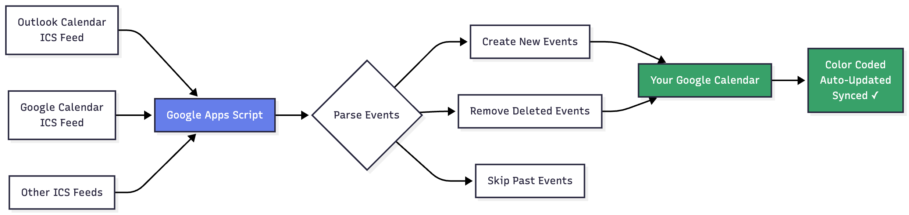
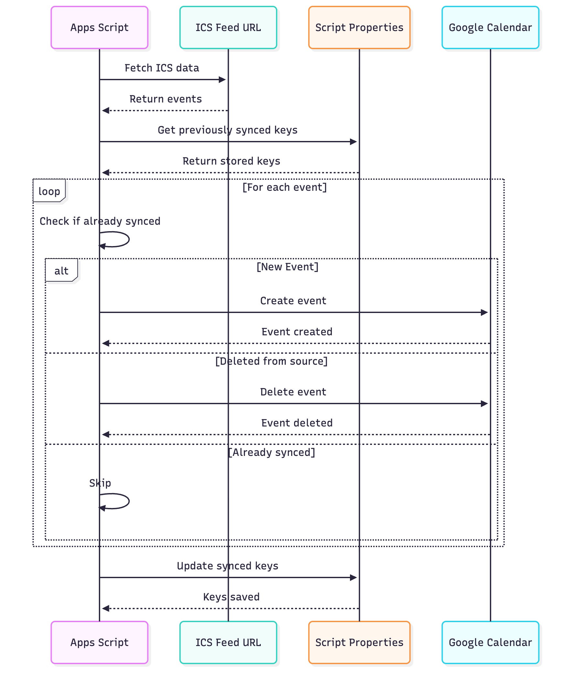

# ICS Calendar Sync for Google Calendar

Automatically sync multiple ICS calendar feeds into your Google Calendar. This script creates copies of events from external calendars (Outlook, other Google Calendars, etc.) and keeps them in sync, including automatic removal when events are deleted from the source.

## Features

- ✅ Sync multiple ICS feeds into one Google Calendar
- ✅ Automatic cleanup - removes events when deleted from source
- ✅ Color coding - assign different colors to different feeds
- ✅ Custom prefixes - easily identify which calendar events came from
- ✅ Timezone aware - handles different timezones correctly
- ✅ Automated sync - set up triggers to run hourly/daily
- ✅ Single events only - skips recurring events to avoid complexity

## Limitations

- Only syncs **single (non-recurring) events**
- Syncs events from today onwards (past events ignored)
- Requires publicly accessible ICS feed URLs

## How It Works

### System Flow


### Sync Process


1. **Fetches** each ICS feed URL
2. **Parses** event data (UID, dates, titles)
3. **Creates** new events in your Google Calendar with:
   - Color coding
   - Title prefixes
   - Tracking information in description
4. **Tracks** synced events using UIDs
5. **Removes** events that no longer exist in the source feed

## Setup Instructions

### Step 1: Get Your ICS Feed URLs

#### For Outlook/Office 365:
1. Open Outlook Calendar (web version)
2. Click Settings → View all Outlook settings → Calendar → Shared calendars
3. Under "Publish a calendar", select the calendar
4. Click "Publish" and copy the **ICS link**

#### For Google Calendar:
1. Open Google Calendar settings
2. Select the calendar you want to share
3. Scroll to "Integrate calendar"
4. Copy the **Secret address in iCal format**

### Step 2: Create Google Apps Script Project

1. Go to [script.google.com](https://script.google.com)
2. Click **+ New project**
3. Delete the default code
4. Copy-paste the entire `Code.gs` file from this repository
5. Click the save icon and name your project (e.g., "ICS Calendar Sync")

### Step 3: Configure Your Feeds

In the script, find the `ICS_FEEDS` section and replace with your details:

```javascript
const ICS_FEEDS = [
  {
    name: 'WORK_OUTLOOK',                              // Internal identifier (must be unique)
    url: 'https://outlook.office365.com/owa/calendar/YOUR_CALENDAR_ID@company.com/YOUR_SECRET_TOKEN/calendar.ics',
    color: CalendarApp.EventColor.ORANGE,              // Orange for work events
    titlePrefix: 'Work '                               // Prefix shown before event title
  },
  {
    name: 'TEAM_CALENDAR',
    url: 'https://outlook.office365.com/owa/calendar/TEAM_CALENDAR_ID@company.com/TEAM_SECRET_TOKEN/calendar.ics',
    color: CalendarApp.EventColor.BLUE,                // Blue for team events
    titlePrefix: 'Team '
  },
  {
    name: 'PERSONAL_GOOGLE',
    url: 'https://calendar.google.com/calendar/ical/your.email%40gmail.com/public/basic.ics',
    color: CalendarApp.EventColor.RED,                 // Red for personal events
    titlePrefix: 'Personal '
  },
  {
    name: 'PRIVATE_CALENDAR',
    url: 'https://calendar.google.com/calendar/ical/another.email%40gmail.com/private-YOUR_PRIVATE_TOKEN/basic.ics',
    color: CalendarApp.EventColor.GREEN,               // Green for private events
    titlePrefix: 'Private '
  }
  // Add more feeds by copying the object structure above
];
```

**Available Colors:**
`PALE_BLUE`, `PALE_GREEN`, `MAUVE`, `PALE_RED`, `YELLOW`, `ORANGE`, `CYAN`, `GRAY`, `BLUE`, `GREEN`, `RED`

### Step 4: Authorize the Script

1. In the script editor, select `syncAllIcsFeeds` from the function dropdown
2. Click the **Run** button (▶️)
3. Click **Review permissions** when prompted
4. Choose your Google account
5. Click **Advanced** → **Go to [your project name] (unsafe)**
6. Click **Allow**

### Step 5: Run Initial Sync

1. After authorization, click **Run** again
2. Click **View** → **Executions** to see the sync progress
3. Check your Google Calendar - you should see synced events with your prefixes

### Step 6: Set Up Automatic Sync (Recommended)

1. In the script editor, click the clock icon (⏰) - "Triggers"
2. Click **+ Add Trigger** (bottom right)
3. Configure:
   - Function: `syncAllIcsFeeds`
   - Deployment: `Head`
   - Event source: `Time-driven`
   - Type: `Hour timer`
   - Hour interval: `Every hour` (or your preference)
4. Click **Save**

Your calendars will now sync automatically!

## Usage

### Manual Sync
Run `syncAllIcsFeeds` function anytime to sync all feeds immediately.

### Clean Up All Synced Events
If you need to start fresh:
1. Select `deleteSyncedEvents` function
2. Click **Run**
3. All synced events will be removed

### View Sync Logs
1. Click **View** → **Executions**
2. Click on any execution to see detailed logs
3. Look for:
   - `New single events created: X` - events added
   - `Removed events from calendar: X` - events deleted

## Troubleshooting

### Events not showing up?
- Verify your ICS feed URL is publicly accessible (open in browser)
- Check execution logs for errors
- Ensure events are today or in the future
- Confirm events are single (not recurring)

### Duplicate events?
- Run `deleteSyncedEvents` then sync again
- Make sure you're not running the sync function multiple times simultaneously

### Authorization errors?
- Re-run Step 4 to authorize again
- Check if your Google account has calendar access

### Wrong timezone?
- The script uses your Google Calendar's timezone
- Check your calendar settings if events appear at wrong times

## How It Works

1. **Fetches** each ICS feed URL
2. **Parses** event data (UID, dates, titles)
3. **Creates** new events in your Google Calendar with:
   - Color coding
   - Title prefixes
   - Tracking information in description
4. **Tracks** synced events using UIDs
5. **Removes** events that no longer exist in the source feed

## Privacy & Security

- Script only accesses your Google Calendar
- ICS feed URLs must be accessible (public or shared links)
- No data is sent to external servers
- All processing happens within Google Apps Script

## Contributing

Found a bug or have a feature request? Open an issue or submit a pull request!

## License

MIT License - feel free to use and modify as needed.


---

**Note:** This script is provided as-is. Always test with non-critical calendars first.
